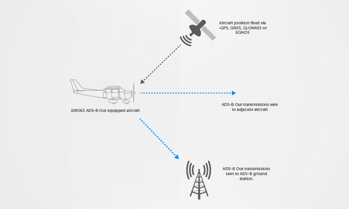
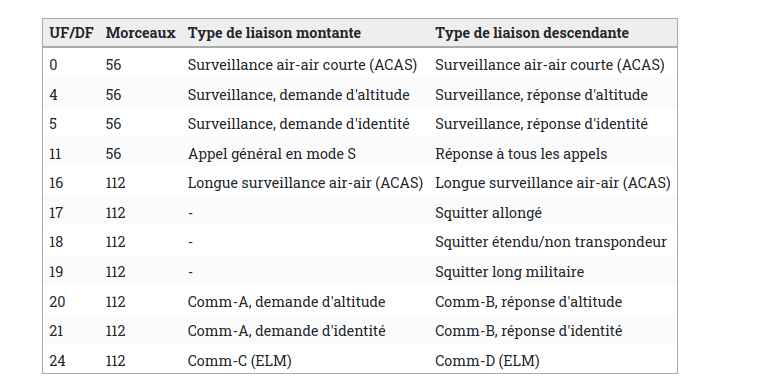
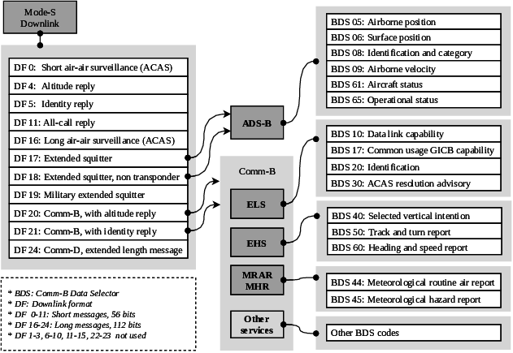

# ADS-B Decoder - Ruby

Today I present to you the use and operation of my ADS-B decoder. 

## What is ADS-B?

ADS-B for Automatic Dependent Surveillance-Broadcast is a satellite surveillance system for obtaining information on air traffic. Unlike other signals, this one does not wait for any interrogation. Its position is fixed via a satellite. 



## How to receive ADS-B transmission?

To do so, I won't dwell on the manual technical side of the thing, but you need a tool allowing you to intercept frequencies, such as the RTL-SDR which does it very well. You will also need an antenna set under a frequency of <b> 1090MHz </b>, this is the frequency emitted by the aircraft's transponder. On the other hand, the plane does not send only one type of transmission. Today planes use a transmission method called <b> mode S </b> which allows selective interrogation. 



## How to detect an ADS-B transmission?

Indeed in the S mode there are several types, as well as their type of connection. It can be seen only in the table above. The modes requiring an interrogation and those requiring no interrogation. If we analyze the table well there are three interesting formats which are 17-18-19.
The three modes are interesting they do not require any interrogation from the SSR.

This means that the formats there are sent automatically by the aircraft just like our ADS-B technology. To detect if this is an ADS-B transmission, just look at the first 3 bits of our "ME" which is a 56-bit segment sent in the ADS-B frame. 



## Analysis of an ADS-B frame 

```
+----------+----------+-------------+------------------------+-----------+
|  DF (5)  |  CA (3)  |  ICAO (24)  |         ME (56)        |  PI (24)  |
+----------+----------+-------------+------------------------+-----------+
```

Rest of the explanation when I have time ... 

## Using the ADS-B decoder

For the moment I have only implemented the decoding part of TC, CA, and Device name. Soon I will implement the position.

Decoding frame identification: 

```ruby
dec = ADS_B::Decoder.new
error, tc, ca, name = dec.decode(0x8D4840D6202CC371C32CE0576098)

puts "Infos ADS-B -> 0x8D4840D6202CC371C32CE0576098"
puts "Nom appareil => #{name}" # KLM1023_
puts "Type de code => #{tc}" # 4
puts "Catégorie => #{ca}" # 0
```

Global frame decoding unambiguous position: 

```ruby
dec = ADS_B::Decoder.new
lat, long = dec.decode_position_globally(0x8D40621D58C382D690C8AC2863A7, 0x8D40621D58C386435CC412692AD6)

puts "latitude: #{lat}"
puts "longitude: #{long}"
```
