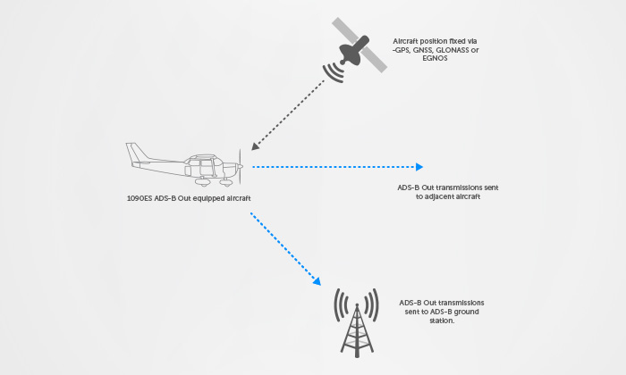
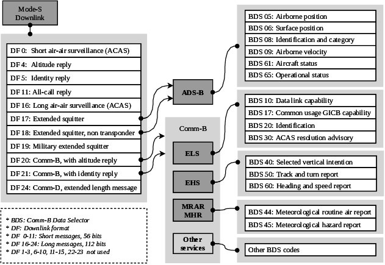

# ADS-B Decoder - Ruby

Aujourd'hui je vous présente l'utilisation et le fonctionnement de mon décodeur ADS-B.

## C'est quoi l'ADS-B ?

L'ADS-B pour Automatic Dependent Surveillance-Broadcast est un système de surveillance, par satellite, pour obtenir des informations sur le trafic aérien. Contrairement aux autres signaux celui-ci n'attend aucune intérrogation. Sa position est fixée via un satellite.



## Comment réceptionner la transmision ADS-B ?

Pour se faire je ne vais pas m'attarder sur le côté technique manuelle de la chose, mais il vous faut un outil vous permettant d'intercépter des frequences, tel que le RTL-SDR qui le fait très bien. Il faudra également une antenne réglé sous une fréquence de <b>1090MHz</b>, c'est la fréquence émise par le transpondeur de l'avion. En revanche l'avion n'envoit pas qu'un seul type de transmission. Aujourd'hui les avions utilisent une methode de transmission appelé <b>mode S</b> celui-ci permet une interrogation selective. 


## Comment détecter une transmission ADS-B ?

En effet dans le mode S il existe plusieurs types, ainsi que leur type de liaison. On peut y voir que dans le tableau ci-dessus. Les modes necessitant une intérrogation et ceux ne nécessitant aucune intérrogation. Si l'on analyse bien le tableau il existe trois format intéressant qui sont 17-18-19.
Les trois modes sont intéressant ils ne nécessitent aucune interrogation de la part du SSR.

Cela veut dire que les format là sont envoyé de manière automatique par l'avion tout comme notre technologie ADS-B. Pour détecter si il s'agit d'une transmission ADS-B il suffit de regarder les 3 premiers bits de notre "ME" qui est un segment de 56 bits envoyé dans la trame ADS-B.



## Analyse d'une trame ADS-B

```
+----------+----------+-------------+------------------------+-----------+
|  DF (5)  |  CA (3)  |  ICAO (24)  |         ME (56)        |  PI (24)  |
+----------+----------+-------------+------------------------+-----------+
```

Reste de l'explication quand j'ai le temps ...

## Utilisation du ADS-B décodeur

Pour le moment je n'ai implémenté que la partie decoding du TC, CA, et Nom de l'appareil. Prochainement j'implémenterais la position.

Decoding identification trame:

```ruby
dec = ADS_B::Decoder.new
error, tc, ca, name = dec.decode(0x8D4840D6202CC371C32CE0576098)

puts "Infos ADS-B -> 0x8D4840D6202CC371C32CE0576098"
puts "Nom appareil => #{name}" # KLM1023_
puts "Type de code => #{tc}" # 4
puts "Catégorie => #{ca}" # 0
```

Decoding trame global position non ambigue:

```ruby
dec = ADS_B::Decoder.new
lat, long = dec.decode_position_globally(0x8D40621D58C382D690C8AC2863A7, 0x8D40621D58C386435CC412692AD6)

puts "latitude: #{lat}"
puts "longitude: #{long}"
```
